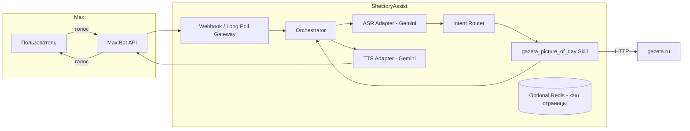

# ТЗ на Shectory Assist

**Версия документа:** 0.1  
**Дата:** 17.04.2026  
**Статус:** проектирование (MVP)

---

## 1. Резюме

**Shectory Assist** — голосовой ассистент в мессенджере **Max**, который принимает голосовые сообщения пользователя, понимает намерение, выполняет действия через подключаемые **навыки (skills)** и отвечает **голосом** (синтез речи с выбором голоса). Для распознавания и генерации речи в MVP используется **коммерческий стек Google Gemini** (подписка заказчика).

Цель первой итерации — доказать сквозной сценарий: **голос → извлечение задачи → навык «новости Gazeta.ru» → голосовой ответ** с контентом блока «картина дня».

---

## 2. Цели и границы

### 2.1. Бизнес-цели

- Снизить порог входа: пользователь **не печатает**, а **говорит**.
- Обеспечить **масштабирование функциональности** за счёт навыков без переписывания ядра бота.
- Заложить основу для дальнейших интеграций (календарь, поиск, домашние сценарии и т.д.).

### 2.2. Не цели MVP

- Мультипользовательские роли, админ-панель, биллинг.
- Обучение собственных моделей; fine-tuning под домен.
- Гарантия юридической «чистоты» парсинга сторонних сайтов (см. раздел 7) — в MVP допускается **ограниченный** объём выборки под демонстрацию с явным предупреждением и планом замены на официальные источники.

### 2.3. Критерий успеха MVP

Пользователь отправляет **одно голосовое** с формулировкой уровня:  
«Привет, прочитай мне топики новостей с сайта gazeta.ru».

Бот:

1. Распознаёт речь (Gemini / связанный API).
2. Определяет намерение: **прочитать топики** из **Gazeta.ru**, блок **«картина дня»** (или эквивалентный фрагмент главной).
3. Парсит страницу, извлекает **список заголовков** (как в примере из ТЗ).
4. Синтезирует **голосовой ответ** выбранным голосом и отправляет **голосовое** (или допустимый в Max формат медиа-ответа — уточняется по Bot API на этапе исследования).

---

## 3. Пользовательские сценарии (MVP)

| ID | Сценарий | Ожидаемый результат |
|----|-----------|---------------------|
| U1 | Первое обращение голосом | Приветствие + краткая подсказка, что умеет бот |
| U2 | Запрос новостей Gazeta.ru голосом | Голосовой перечень заголовков из «картины дня» |
| U3 | Тот же запрос текстом (опционально в MVP) | Тот же результат в виде текста или голоса по настройке |
| U4 | Смена голоса (если поддерживается API) | Сохранение предпочтения пользователя в профиле сессии/БД |

---

## 4. Функциональные требования

### 4.1. Интеграция с Max

- Регистрация и работа бота через **официальный Max Bot API** ([документация для разработчиков](https://dev.max.ru/docs)).
- Приём обновлений: **long polling** для локальной разработки и/или **webhook** для продакшена (HTTPS, проверка подписи согласно документации платформы).
- Обработка входящих **голосовых вложений**: загрузка бинарного файла по URL из апдейта (если предоставляется), нормализация формата для пайплайна Gemini.

**Заметка по риску:** наличие методов отправки **исходящего голоса** в Max нужно **верифицировать** на этапе «Spike Max API»; при ограничениях — MVP допускает **голос + текст** или **аудиофайл как документ** как временный контракт ответа.

### 4.2. Обработка звука (Gemini)

- **ASR (speech-to-text):** передача аудио в мультимодальный запрос Gemini, получение текста транскрипта.
- **NLU / маршрутизация:** на основе транскрипта формируется структура намерения (intent) и параметры (entities): источник новостей, тип блока («картина дня»), язык, предпочтение голоса.
- **TTS (text-to-speech):** генерация аудио ответа из подготовленного текста (агрегация заголовков в связный сценарий чтения), выбор **голоса** из поддерживаемого набора API.

Требования к конфигурации:

- Ключи и квоты хранятся **только** в переменных окружения / секрет-хранилище; в репозитории **нет** секретов.
- Логирование: **не** писать в логи сырое аудио и полный текст персональных сообщений без необходимости; маскирование PII.

### 4.3. Система навыков (Skills)

**Навык** — изолированный модуль с контрактом:

```text
SkillInput  { userId, locale, transcriptText, intent, entities, traceId }
SkillOutput { messages: TextPart[], audioPolicy?, metadata? }
```

- **Реестр навыков:** статическая регистрация на этапе MVP; далее — динамическая загрузка (плагины) или отдельные микросервисы.
- **Маршрутизация:** таблица соответствия `intent → skill` + fallback «не понял запрос».
- **Первый навык:** `gazeta_picture_of_day` — HTTP GET главной Gazeta.ru, парсинг DOM/CSS-селекторы для блока «картина дня», извлечение списка заголовков, нормализация текста (обрезка пробелов, фильтр дублей).

### 4.4. Оркестрация диалога

Единый **Orchestrator** (конечный автомат лёгкой сложности):

1. Получить событие Max → извлечь `userId`, медиа.
2. ASR → текст.
3. Классификация намерения (правила + лёгкий LLM-вызов Gemini при необходимости).
4. Вызов навыка → текст ответа.
5. TTS → аудио.
6. Отправка ответа в Max.

Идемпотентность: `message_id` / `update_id` для защиты от повторной обработки при ретраях сети.

---

## 5. Нефункциональные требования

| Категория | Требование (MVP) |
|-----------|------------------|
| Доступность | Один инстанс бэкенда; health-check `/health` |
| Задержка | Целевой p95 «голос в → голос из» ≤ 25–40 с при типичной длине запроса (зависит от Gemini и парсинга) |
| Наблюдаемость | Структурированные логи, `traceId`, метрики счётчиков ошибок по этапам |
| Безопасность | TLS наружу, ротация токенов Max/Gemini, rate limit на пользователя |
| Соответствие | Учёт 152-ФЗ: размещение в РФ при необходимости, минимизация ПДн, политика хранения |

---

## 6. Архитектура

### 6.1. Логическая схема



### 6.2. Рекомендуемый репозиторий (монолит MVP)

```text
shectory-assist/
├── apps/
│   └── bot/                 # HTTP-сервер + обработчик Max
├── packages/
│   ├── core/                # Orchestrator, типы, идемпотентность
│   ├── adapters/
│   │   ├── max/             # Клиент Max Bot API
│   │   └── gemini/          # ASR, NLU, TTS обёртки
│   └── skills/
│       └── gazeta/          # Парсер «картины дня»
├── infra/
│   └── docker-compose.yml   # опционально
└── docs/
    └── ТЗ на Shectory Assist.md
```

**Язык реализации (рекомендация):** TypeScript (Node.js) — совместимо с экосистемой `@maxhub/max-bot-api` и удобно для типизированных контрактов навыков. Допустим Python, если команда сильнее в нём: тогда отдельный HTTP-сервис и те же границы пакетов.

### 6.3. Данные

- **SQLite / PostgreSQL (на выбор):** профиль пользователя (предпочитаемый голос, locale), журнал обработанных `message_id`.
- **Кэш:** короткий TTL для HTML главной Gazeta.ru (30–120 с), чтобы не долбить сайт при повторных запросах.

### 6.4. Внешние зависимости

| Сервис | Назначение |
|--------|------------|
| Max Bot API | Вход/выход сообщений |
| Google AI / Vertex (по типу подписки) | ASR, рассуждение/маршрутизация, TTS |
| gazeta.ru | Источник HTML для MVP-навыка |

---

## 7. Правовые и этические ограничения (парсинг)

- HTML-парсинг публичной главной **может противоречить** пользовательскому соглашению сайта; для продуктивной версии предпочтительны **официальный RSS/API** или **лицензированный** контент-партнёр.
- В документации MVP явно указать: демо-режим, ограничение частоты, `User-Agent` с контактом владельца бота.

---

## 8. Риски и меры

| Риск | Мера |
|------|------|
| Max не отдаёт/не принимает голос так, как задумано | Spike в первую неделю; запасной канал ответа |
| Изменение вёрстки Gazeta.ru | Выделенный слой селекторов, быстрые тесты, алерт по пустому результату |
| Квоты Gemini | Кэш, сжатие промптов, очередь с backoff |
| Длинный список заголовков | Обрезка до N пунктов + фраза «и ещё …» |

---

## 9. Этапы реализации

### Этап 0 — Подготовка (3–5 дней)

- Регистрация бота в Max, фиксация возможностей **входящего/исходящего аудио** в API.
- Создание репозитория, CI (lint/test), шаблон `.env.example` без секретов.
- Минимальный echo-бот в Max (текст).

### Этап 1 — Аудио-пайплайн Gemini (5–8 дней)

- Интеграция ASR: голосовое → текст.
- Интеграция TTS: текст → аудио, выбор голоса.
- Юнит-тесты на моках API.

### Этап 2 — Оркестратор и навыки (5–7 дней)

- Контракт `SkillInput` / `SkillOutput`, реестр, маршрутизация `intent`.
- Навык `gazeta_picture_of_day`: загрузка, парсинг, нормализация списка.
- Сквозной тест на фикстуре HTML (снимок страницы в `fixtures/`).

### Этап 3 — Склейка с Max и MVP-полировка (4–6 дней)

- Полный сценарий U2: голос → ответ голосом.
- Идемпотентность, логи, `/health`, базовый rate limit.
- Документация запуска (README для разработчика — отдельно от настоящего ТЗ).

### Этап 4 — Пост-MVP (бэклог)

- RSS/официальные источники вместо парсинга.
- Дополнительные навыки как отдельные пакеты/сервисы.
- Админ-метрики, A/B голосов, мультиязычие.

---

## 10. Открытые вопросы к заказчику

1. Точный продукт доступа к Gemini: **Google AI Studio (API key)** или **Vertex AI / Workspace** — от этого зависят эндпоинты и лимиты.
2. Требования к **хостингу** (только РФ, облако, on-prem).
3. Нужен ли в MVP **выбор голоса** через команду в чате или достаточно конфигурации по умолчанию.

---

## 11. Глоссарий

- **Max** — мессенджер, официальный Bot API.
- **Skill** — подключаемый модуль с контрактом входа/выхода.
- **Orchestrator** — компонент, связывающий Max, Gemini и навыки.

---

*Документ является основой для разработки; при изменении API Max или политик Google разделы 4 и 6 уточняются без изменения общей идеи продукта.*
